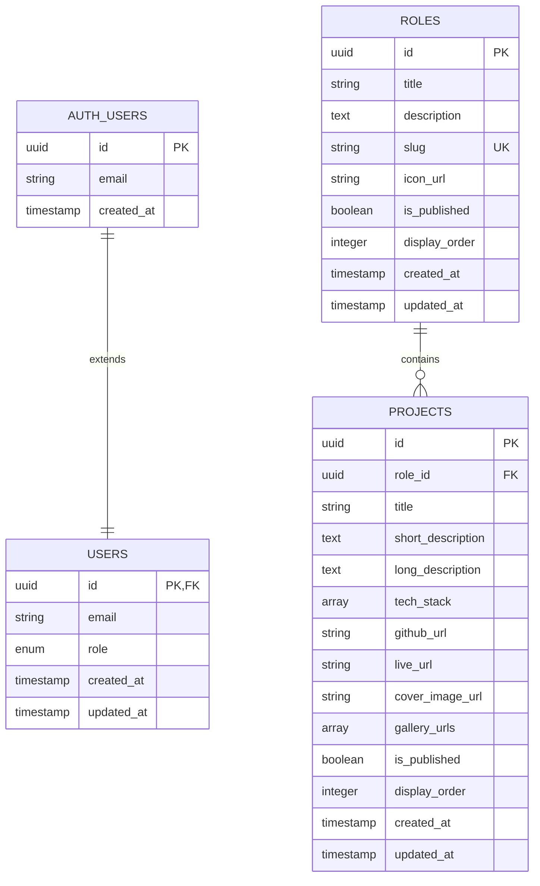
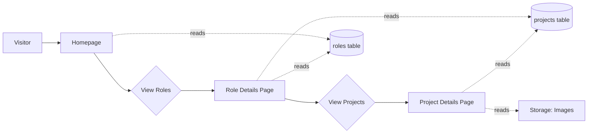
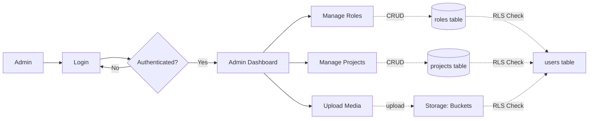
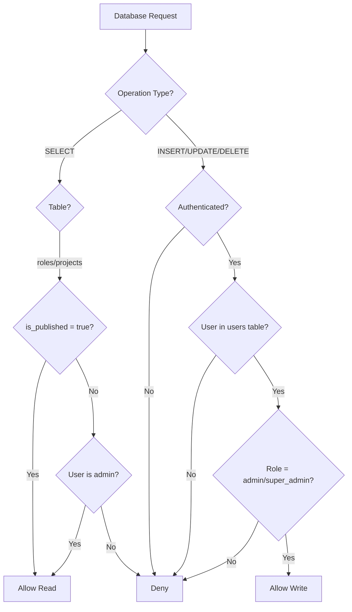
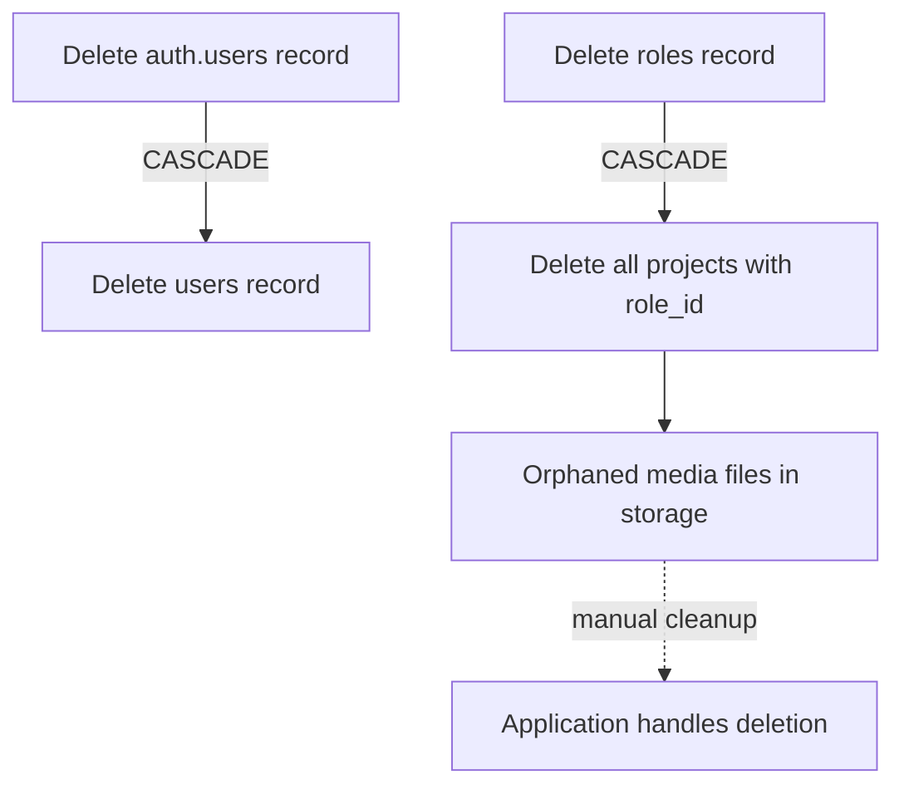
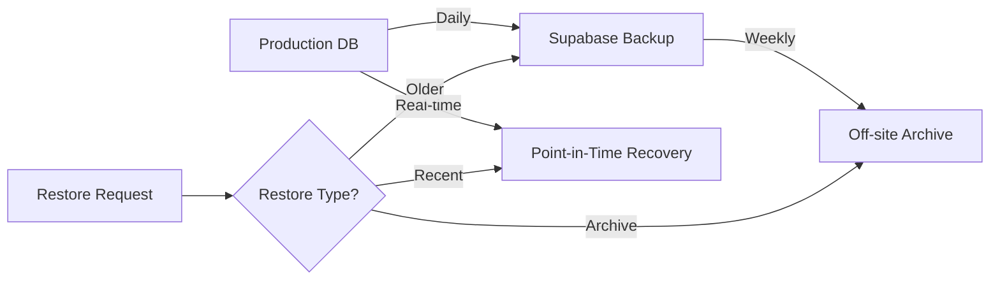

# Database Visual Diagram

## Entity Relationship Diagram (ERD)



## Storage Buckets Structure

```
Storage
├── project-images/ (public, 5MB limit)
│   └── roles/
│       └── {roleId}/
│           └── projects/
│               └── {projectId}/
│                   ├── cover.jpg
│                   ├── gallery-1.jpg
│                   ├── gallery-2.jpg
│                   └── ...
│
└── role-icons/ (public, 2MB limit)
    └── roles/
        └── {roleId}/
            └── icon.svg
```

## Data Flow Diagram

### Public User Flow



### Admin User Flow



## Row Level Security (RLS) Flow



## Index Strategy

### Roles Table Indexes

```
┌─────────────────────────────────────┐
│           roles table               │
├─────────────────────────────────────┤
│ PRIMARY KEY: id                     │
│ UNIQUE: slug                        │
│                                     │
│ Indexes:                            │
│ • idx_roles_slug (slug)            │
│ • idx_roles_is_published           │
│ • idx_roles_display_order          │
│ • idx_roles_published_order        │
│   (is_published, display_order)    │
│   WHERE is_published = true        │
└─────────────────────────────────────┘
```

### Projects Table Indexes

```
┌─────────────────────────────────────┐
│         projects table              │
├─────────────────────────────────────┤
│ PRIMARY KEY: id                     │
│ FOREIGN KEY: role_id → roles(id)   │
│                                     │
│ Indexes:                            │
│ • idx_projects_role_id             │
│ • idx_projects_is_published        │
│ • idx_projects_display_order       │
│ • idx_projects_role_published_order│
│   (role_id, is_published,          │
│    display_order)                  │
│   WHERE is_published = true        │
└─────────────────────────────────────┘
```

## Query Performance Patterns

### Fast Queries (Using Indexes)

✅ **Get published roles ordered by display_order**
```sql
SELECT * FROM roles 
WHERE is_published = true 
ORDER BY display_order;
-- Uses: idx_roles_published_order
```

✅ **Get role by slug**
```sql
SELECT * FROM roles 
WHERE slug = 'web-developer';
-- Uses: idx_roles_slug (unique index)
```

✅ **Get published projects for a role**
```sql
SELECT * FROM projects 
WHERE role_id = 'uuid' 
  AND is_published = true 
ORDER BY display_order;
-- Uses: idx_projects_role_published_order
```

### Slow Queries (No Index)

⚠️ **Full-text search on descriptions**
```sql
SELECT * FROM roles 
WHERE description ILIKE '%keyword%';
-- Sequential scan (slow for large tables)
```

⚠️ **Filter by tech_stack array**
```sql
SELECT * FROM projects 
WHERE 'React' = ANY(tech_stack);
-- Sequential scan (consider GIN index if needed)
```

## Cascade Behavior



**Important**: When deleting a role, all associated projects are automatically deleted (CASCADE), but media files in storage must be manually cleaned up by the application.

## Security Layers

```
┌─────────────────────────────────────────┐
│         Application Layer               │
│  • Input validation                     │
│  • Authentication checks                │
│  • Business logic                       │
└──────────────┬──────────────────────────┘
               │
┌──────────────▼──────────────────────────┐
│         Supabase Client                 │
│  • JWT token validation                 │
│  • API key verification                 │
└──────────────┬──────────────────────────┘
               │
┌──────────────▼──────────────────────────┐
│    Row Level Security (RLS)             │
│  • Policy evaluation                    │
│  • User role checks                     │
│  • Published status checks              │
└──────────────┬──────────────────────────┘
               │
┌──────────────▼──────────────────────────┐
│      PostgreSQL Database                │
│  • Constraints (FK, CHECK, UNIQUE)      │
│  • Data types                           │
│  • Triggers                             │
└─────────────────────────────────────────┘
```

## Typical Data Sizes

### Development/Testing
- Roles: 3-5 records
- Projects: 10-20 records
- Users: 1-3 records
- Storage: < 100MB

### Small Portfolio
- Roles: 3-10 records
- Projects: 20-50 records
- Users: 1-5 records
- Storage: 100MB - 500MB

### Large Portfolio
- Roles: 10-20 records
- Projects: 100-500 records
- Users: 5-20 records
- Storage: 500MB - 2GB

## Performance Benchmarks

With proper indexing:

| Operation | Expected Time | Notes |
|-----------|--------------|-------|
| Get published roles | < 10ms | Uses partial index |
| Get role by slug | < 5ms | Uses unique index |
| Get projects by role | < 20ms | Uses composite index |
| Insert role | < 50ms | Includes RLS check |
| Update project | < 50ms | Includes RLS check |
| Delete with cascade | < 100ms | Deletes related records |

## Backup Strategy



## Monitoring Points

Key metrics to monitor:

1. **Query Performance**
   - Slow query log (> 200ms)
   - Index usage statistics
   - Connection pool utilization

2. **Storage Usage**
   - Database size growth
   - Storage bucket usage
   - Backup size

3. **Security**
   - Failed authentication attempts
   - RLS policy violations
   - Unusual access patterns

4. **Data Integrity**
   - Foreign key violations
   - Constraint violations
   - Orphaned records
